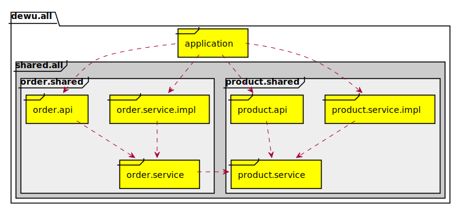
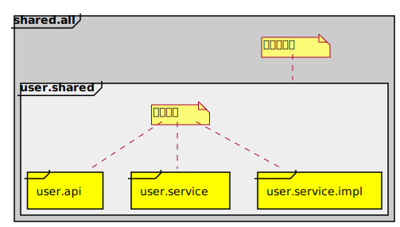

# practice_dewu_dubbo

> 对practice_dewu项目中的用户、商品、订单模块进行Dubbo优化重构，使符合模块化、服务化的要求。

## 主要目标

1、在同一个项目中，集成商品和订单两个子模块；

2、去除代码中的UserService，跟用户相关的功能改为调用Dubbo服务。

### 商品、订单模块划分设计

### 用户系统服务化

- #### 用户系统的模块化改造：

- #### 序列化接口实现

- #### 将用户服务注册到nacos 注册中心

- #### 商品、订单模块通过注册中心找到用户服务，调用其方法

